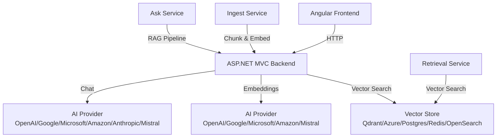

# Payment Ops Console

An internal tool for payments engineers to ingest runbooks, integration docs, and incident notes, then answer questions with checklists and citations using RAG (Retrieval-Augmented Generation).

## Features

- ✅ **Document Ingestion**: Upload markdown/text files or ingest from sample folder
- ✅ **RAG Chat**: Ask questions and get answers with citations
- ✅ **Sources Browser**: View ingested documents and their chunks
- ✅ **Evaluation Harness**: Offline evaluation of RAG quality
- ✅ **Guardrails**: Prompt injection detection, request limits, secret redaction
- ✅ **Observability**: OpenTelemetry tracing, structured logging, correlation IDs
- ✅ **Multi-Vector Database Support**: Switchable between Qdrant, Azure AI Search, Postgres pgvector, Redis, and Amazon OpenSearch
- ✅ **Multi-AI Provider Support**: Switchable between OpenAI, Google AI, Microsoft AI, Amazon AI, Anthropic, and Mistral AI

## Architecture



## Quick Start

### Prerequisites

- .NET 8 SDK
- Node.js 18+ and npm
- Docker Desktop (for Qdrant, Postgres, or Redis)
- AI Provider API key (OpenAI, Google, Microsoft, Amazon, Anthropic, or Mistral)

### 1. Start Vector Database (Optional - if using Qdrant, Postgres, or Redis)

**For Qdrant:**
```bash
docker-compose up -d
```

**For Postgres with pgvector:**
```bash
docker run -d --name postgres-pgvector -e POSTGRES_PASSWORD=postgres -p 5432:5432 pgvector/pgvector:pg16
```

**For Redis:**
```bash
docker run -d --name redis -p 6379:6379 redis/redis-stack:latest
```

### 2. Configure Backend

The backend uses a factory pattern to support multiple vector databases and AI providers. Configuration is done via `appsettings.json` (stub values) and User Secrets (actual credentials).

**Set User Secrets (Recommended):**

```bash
cd src/PaymentOps.Backend

# For OpenAI (default)
dotnet user-secrets set "AI:Provider" "OpenAI"
dotnet user-secrets set "AI:OpenAI:ApiKey" "your-api-key-here"

# For Qdrant (default vector store)
dotnet user-secrets set "VectorStore:Provider" "Qdrant"
dotnet user-secrets set "VectorStore:Qdrant:BaseUrl" "http://localhost:6333"
```

**Example: Using Azure AI Search and Microsoft AI:**
```bash
dotnet user-secrets set "AI:Provider" "Microsoft"
dotnet user-secrets set "AI:Microsoft:Endpoint" "https://your-resource.openai.azure.com"
dotnet user-secrets set "AI:Microsoft:ApiKey" "your-api-key"
dotnet user-secrets set "AI:Microsoft:EmbeddingDeploymentName" "text-embedding-ada-002"
dotnet user-secrets set "AI:Microsoft:ChatDeploymentName" "gpt-35-turbo"

dotnet user-secrets set "VectorStore:Provider" "AzureAISearch"
dotnet user-secrets set "VectorStore:AzureAISearch:ServiceName" "your-service-name"
dotnet user-secrets set "VectorStore:AzureAISearch:ApiKey" "your-api-key"
dotnet user-secrets set "VectorStore:AzureAISearch:IndexName" "paymentops-chunks"
```

**Example: Using Postgres pgvector and Google AI:**
```bash
dotnet user-secrets set "AI:Provider" "Google"
dotnet user-secrets set "AI:Google:ApiKey" "your-api-key"
dotnet user-secrets set "AI:Google:EmbeddingModel" "models/embedding-001"
dotnet user-secrets set "AI:Google:ChatModel" "models/gemini-pro"

dotnet user-secrets set "VectorStore:Provider" "Postgres"
dotnet user-secrets set "VectorStore:Postgres:ConnectionString" "Host=localhost;Database=paymentops;Username=postgres;Password=postgres"
```

### 3. Run Services

**Option A: Use run scripts**

```bash
# Windows
.\run-local.ps1

# Linux/Mac
chmod +x run-local.sh
./run-local.sh
```

**Option B: Manual start**

```bash
# Terminal 1: Backend
cd src/PaymentOps.Backend
dotnet run

# Terminal 2: Frontend
cd frontend/payment-ops-ui
npm install
ng serve --open
```

### 4. Access Applications

- **Frontend**: http://localhost:4200
- **Backend API**: http://localhost:5000
- **Swagger UI**: http://localhost:5000/swagger
- **Qdrant Dashboard** (if using Qdrant): http://localhost:6333/dashboard

## Supported Vector Databases

The application supports multiple vector database providers that can be switched via configuration:

1. **Qdrant** (default) - Fast, open-source vector database
2. **Azure AI Search** - Managed search service with vector capabilities
3. **Postgres pgvector** - PostgreSQL extension for vector similarity search
4. **Redis** - Redis with RediSearch for vector search
5. **Amazon OpenSearch** - OpenSearch with k-NN plugin

Configuration is done via `VectorStore:Provider` in `appsettings.json` and User Secrets.

## Supported AI Providers

The application supports multiple AI providers for embeddings and chat:

### Embedding Providers
- **OpenAI** - `text-embedding-3-small`, `text-embedding-3-large`
- **Google AI** - `models/embedding-001`
- **Microsoft AI (Azure OpenAI)** - `text-embedding-ada-002`
- **Amazon AI (Bedrock)** - `amazon.titan-embed-text-v1`
- **Mistral AI** - `mistral-embed`

### Chat Providers
- **OpenAI** - `gpt-4o-mini`, `gpt-4`, `gpt-3.5-turbo`
- **Google AI** - `models/gemini-pro`
- **Microsoft AI (Azure OpenAI)** - `gpt-35-turbo`, `gpt-4`
- **Amazon AI (Bedrock)** - `anthropic.claude-v2`, `anthropic.claude-3-sonnet-20240229-v1:0`
- **Anthropic** - `claude-3-opus-20240229`, `claude-3-sonnet-20240229`
- **Mistral AI** - `mistral-large-latest`, `mistral-small`

**Note:** Anthropic does not provide an embedding API. Use a different provider for embeddings when using Anthropic for chat.

Configuration is done via `AI:Provider` in `appsettings.json` and User Secrets.

## Usage

### Ingest Documents

**Via UI:**
1. Navigate to "Ingest" page
2. Upload `.md` or `.txt` files
3. Or click "Ingest Sample Runbooks" to load sample data

**Via API:**
```bash
# Ingest text
curl -X POST http://localhost:5000/api/ingest/text \
  -H "Content-Type: application/json" \
  -d '{"docName": "My Doc", "text": "Content here..."}'

# Ingest files
curl -X POST http://localhost:5000/api/ingest/files \
  -F "files=@document.md"

# Ingest samples
curl -X POST http://localhost:5000/api/ingest/samples \
  -H "Content-Type: application/json" \
  -d '{"folderPath": "samples/runbooks"}'
```

### Ask Questions

**Via UI:**
1. Navigate to "Chat" page
2. Type your question
3. View answer with citations

**Via API:**
```bash
curl -X POST http://localhost:5000/api/ask \
  -H "Content-Type: application/json" \
  -d '{
    "question": "Auth rate dropped—what should I check?",
    "topK": 5
  }'
```

### View Sources

**Via UI:**
1. Navigate to "Sources" page
2. Browse ingested documents
3. Click to view chunks

**Via API:**
```bash
# List all sources
curl http://localhost:5000/api/sources

# Get source details
curl http://localhost:5000/api/sources/{documentId}
```

## Testing

The solution includes a unit test project for testing vector database providers, AI client factories, and OpenAPI endpoints.

**Run Tests:**
```bash
dotnet test tests/PaymentOps.Backend.Tests/PaymentOps.Backend.Tests.csproj
```

**Test Coverage:**
- Vector store factory tests for all providers (Qdrant, Azure AI Search, Postgres, Redis, OpenSearch)
- AI client factory tests for all providers (OpenAI, Google, Microsoft, Amazon, Anthropic, Mistral)
- OpenAPI/Swagger integration tests

## Evaluation

Run the evaluation harness to test RAG quality:

```bash
cd src/PaymentOps.Eval
dotnet run http://localhost:5000 ../../../samples/eval/eval.json ../../../samples/eval/report.md
```

View the generated report:
```bash
cat samples/eval/report.md
```

## Project Structure

```
PaymentOpsCopilot/
├── README.md
├── PaymentOpsCopilot.sln      # Solution file with src/ and tests/ folders
├── docker-compose.yml          # Qdrant service
├── run-local.ps1               # Windows run script
├── run-local.sh                # Linux/Mac run script
├── samples/
│   ├── runbooks/               # Sample markdown docs
│   └── eval/
│       ├── eval.json           # Evaluation test cases
│       └── report.md           # Generated evaluation report
├── src/                        # Source projects
│   ├── PaymentOps.Backend/     # ASP.NET MVC backend
│   │   ├── Application/        # Application layer
│   │   │   ├── Interfaces/     # IEmbeddingClient, IChatClient, IVectorStore
│   │   │   └── Services/       # Business logic services
│   │   ├── Controllers/        # API controllers
│   │   ├── Domain/             # Domain models
│   │   ├── DTOs/               # Data transfer objects
│   │   ├── Infrastructure/     # Infrastructure implementations
│   │   │   ├── AIClients/      # AI provider implementations
│   │   │   │   ├── AIClientFactory.cs
│   │   │   │   ├── OpenAI*.cs
│   │   │   │   ├── GoogleAI*.cs
│   │   │   │   ├── MicrosoftAI*.cs
│   │   │   │   ├── AmazonAI*.cs
│   │   │   │   ├── AnthropicChatClient.cs
│   │   │   │   └── MistralAI*.cs
│   │   │   ├── VectorStores/   # Vector database implementations
│   │   │   │   ├── VectorStoreFactory.cs
│   │   │   │   ├── QdrantVectorStore.cs
│   │   │   │   ├── AzureAISearchVectorStore.cs
│   │   │   │   ├── PostgresPgVectorStore.cs
│   │   │   │   ├── RedisVectorStore.cs
│   │   │   │   └── OpenSearchVectorStore.cs
│   │   │   └── Guardrails/     # Security guardrails
│   │   │       └── PromptInjectionDetector.cs
│   │   └── Middleware/         # HTTP middleware
│   └── PaymentOps.Eval/        # Evaluation console app
├── tests/                      # Test projects
│   └── PaymentOps.Backend.Tests/
│       ├── VectorStoreTests.cs
│       ├── AIClientFactoryTests.cs
│       └── OpenApiTests.cs
└── frontend/
    └── payment-ops-ui/         # Angular SPA
```

## Configuration

### Backend (`appsettings.json`)

The `appsettings.json` file contains stub configurations. Actual credentials should be set via User Secrets:

```json
{
  "AI": {
    "Provider": "OpenAI",
    "OpenAI": {
      "ApiKey": "",
      "EmbeddingModel": "text-embedding-3-small",
      "ChatModel": "gpt-4o-mini"
    },
    "Google": {
      "ApiKey": "",
      "EmbeddingModel": "models/embedding-001",
      "ChatModel": "models/gemini-pro"
    },
    "Microsoft": {
      "Endpoint": "",
      "ApiKey": "",
      "EmbeddingDeploymentName": "text-embedding-ada-002",
      "ChatDeploymentName": "gpt-35-turbo"
    },
    "Amazon": {
      "Region": "",
      "AccessKey": "",
      "SecretKey": "",
      "EmbeddingModelId": "amazon.titan-embed-text-v1",
      "ChatModelId": "anthropic.claude-v2"
    },
    "Anthropic": {
      "ApiKey": "",
      "ChatModel": "claude-3-opus-20240229"
    },
    "Mistral": {
      "ApiKey": "",
      "EmbeddingModel": "mistral-embed",
      "ChatModel": "mistral-large-latest"
    }
  },
  "VectorStore": {
    "Provider": "Qdrant",
    "VectorSize": 1536,
    "Qdrant": {
      "BaseUrl": "http://localhost:6333",
      "CollectionName": "paymentops_chunks"
    },
    "AzureAISearch": {
      "ServiceName": "",
      "IndexName": "paymentops-chunks",
      "ApiKey": ""
    },
    "Postgres": {
      "ConnectionString": "",
      "TableName": "chunks",
      "SchemaName": "vector"
    },
    "Redis": {
      "ConnectionString": "",
      "IndexName": "idx:chunks"
    },
    "OpenSearch": {
      "Uri": "",
      "IndexName": "paymentops-chunks",
      "Username": "",
      "Password": ""
    }
  },
  "RAG": {
    "TopK": 5,
    "ChunkSize": 1000,
    "ChunkOverlap": 150,
    "MaxQuestionLength": 2000,
    "EmbeddingBatchSize": 100,
    "VectorStoreBatchSize": 50,
    "MaxFileSizeBytes": 10485760
  },
  "Cors": {
    "AllowedOrigins": [
      "http://localhost:4200"
    ]
  }
}
```

## How It Works

## AI / RAG Glossary (plain English)

This project uses **RAG (Retrieval-Augmented Generation)**: instead of asking an LLM to answer from memory, we first **retrieve** the most relevant snippets from your runbooks and then instruct the model to answer **only** from that retrieved context.

- **LLM (Large Language Model)**: the "chat model" that generates the final answer (here via OpenAI Chat Completions).
- **Prompt**: the text we send to the LLM. We send:
  - **System prompt**: rules/instructions for the assistant (e.g., "only use provided context", "always cite").
  - **User prompt**: the user question + the retrieved context.
- **Tokens**: model input/output units (roughly "word pieces"). More tokens = more cost + latency.
- **Temperature**: randomness knob. Lower values are more deterministic and usually better for operational runbooks.
- **Embedding**: a numeric vector representation of text (an array of floats). Similar texts have "nearby" vectors.
- **Vector / Vector size**: the embedding array; its length must match the model's output dimension (configured via `VectorStore:VectorSize`).
- **Vector database / Vector store**: stores embeddings and lets you run "similarity search" (here: Qdrant, Azure AI Search, Postgres pgvector, Redis, or OpenSearch).
- **Cosine similarity**: the similarity metric used in most vector stores ("Cosine" distance). Higher score ≈ more similar.
- **Chunk**: a slice of a document (we don't embed whole runbooks at once). Each chunk has an `Index` and a short `Snippet`.
- **Chunk overlap**: repeated characters between consecutive chunks so important sentences spanning boundaries aren't lost.
- **TopK**: how many chunks to retrieve for a question (e.g., 5).
- **Similarity threshold (`MinSimilarityScore`)**: optional minimum score; if set too high you may get zero results.
- **Grounding**: forcing the model to answer only using the retrieved context to reduce hallucinations.
- **Hallucination**: when a model invents details not present in the provided context.
- **Citations**: we require the model to cite facts using `[docName:chunkIndex]` and we parse those back out.
- **Prompt injection**: malicious text that tries to override the system rules ("ignore previous instructions…").
- **Guardrails**: checks that block or constrain unsafe inputs/outputs (prompt injection detection, length limits, citation enforcement).

## How the RAG pipeline maps to the code

If you're new to RAG, start with these files (they form a straight-through pipeline):

- **Ingestion (docs → chunks → embeddings → vector DB)**:
  - `src/PaymentOps.Backend/Application/Services/ChunkingService.cs`
  - `src/PaymentOps.Backend/Application/Services/IngestService.cs`
  - `src/PaymentOps.Backend/Infrastructure/AIClients/` (embedding client implementations)
  - `src/PaymentOps.Backend/Infrastructure/VectorStores/` (vector store implementations, `UpsertChunksAsync`)
- **Retrieval (question → embedding → similar chunks)**:
  - `src/PaymentOps.Backend/Application/Services/RetrievalService.cs`
  - `src/PaymentOps.Backend/Infrastructure/VectorStores/` (vector store implementations, `SearchAsync`)
- **Answer generation (question + context → grounded answer + citations)**:
  - `src/PaymentOps.Backend/Application/Services/AskService.cs`
  - `src/PaymentOps.Backend/Infrastructure/AIClients/` (chat client implementations)
- **Guardrails**:
  - `src/PaymentOps.Backend/Infrastructure/Guardrails/PromptInjectionDetector.cs`

### RAG Pipeline

1. **Ingestion**: Documents are chunked (1000 chars, 150 overlap), embedded, and stored in the configured vector database
2. **Retrieval**: User question is embedded and similar chunks are retrieved (topK=5)
3. **Generation**: Retrieved chunks are sent to LLM as context with strict grounding prompt
4. **Citation**: Citations are extracted from answer using regex pattern `[docName:chunkIndex]`

### Guardrails

- **Prompt Injection Detection**: Keyword-based detection of suspicious inputs
- **Request Limits**: Max question length (2000 chars)
- **Secret Redaction**: API keys never logged
- **Grounding Enforcement**: Two-pass validation if no citations found

## Adding Your Own Documents

1. Create markdown or text files in `samples/runbooks/` or any folder
2. Use the UI "Ingest" page to upload files
3. Or use the API `/api/ingest/files` endpoint
4. Documents are automatically chunked and embedded

## Evaluation Details

The evaluation harness (`PaymentOps.Eval`) tests:

- ✅ Citation presence (when `mustCite: true`)
- ✅ Required keywords in answer (from `mustContain` array)
- ✅ "I don't know" response for empty retrieval
- ✅ Citation format validation

Sample output in `samples/eval/report.md`:

```markdown
# Evaluation Report

**Total Tests:** 20
**Passed:** 18 ✅
**Failed:** 2 ❌
**Pass Rate:** 90.0%
```

## Switching Providers

### Switching Vector Database

1. Update `VectorStore:Provider` in User Secrets:
   ```bash
   dotnet user-secrets set "VectorStore:Provider" "AzureAISearch"
   ```
2. Set the required configuration for the new provider (see Configuration section)
3. Restart the backend application

### Switching AI Provider

1. Update `AI:Provider` in User Secrets:
   ```bash
   dotnet user-secrets set "AI:Provider" "Google"
   ```
2. Set the required API keys and configuration for the new provider
3. Restart the backend application

**Note:** The vector size must match the embedding model's output dimension. Most models use 1536 dimensions, but check your specific model's documentation.

## Troubleshooting

### Vector Database Connection Issues

**Qdrant:**
```bash
docker-compose logs qdrant
docker-compose down
docker-compose up -d
curl http://localhost:6333/health
```

**Postgres:**
```bash
# Verify pgvector extension is installed
psql -U postgres -d paymentops -c "CREATE EXTENSION IF NOT EXISTS vector;"
```

**Redis:**
```bash
# Verify Redis is running
redis-cli ping
```

**Azure AI Search:**
- Verify service name and API key are correct
- Check that the index exists or will be created on first run

**OpenSearch:**
- Verify URI, username, and password
- Check network connectivity to OpenSearch cluster

### Backend fails to start

- Set AI provider API key via User Secrets: `dotnet user-secrets set "AI:{Provider}:ApiKey" "..."` (recommended)
- Verify vector database is running and accessible
- Check logs: `dotnet run` in backend directory
- Verify configuration in `appsettings.json` matches your setup

### Frontend build errors
```bash
cd frontend/payment-ops-ui
rm -rf node_modules package-lock.json
npm install
ng serve
```

### No citations in answers
- Verify documents are ingested: `GET /api/sources`
- Check retrieval is working: Look for `retrieved` array in response
- Review LLM prompt in `AskService.cs`
- Verify the AI provider supports the citation format

### Tests failing
```bash
# Run tests with verbose output
dotnet test tests/PaymentOps.Backend.Tests/PaymentOps.Backend.Tests.csproj --verbosity normal

# Build test project
dotnet build tests/PaymentOps.Backend.Tests/PaymentOps.Backend.Tests.csproj
```

## Next Improvements

- [ ] Reranking: Use cross-encoder to improve retrieval quality
- [ ] Hybrid Search: Combine vector search with keyword search
- [ ] Authentication: Add JWT auth for multi-user support
- [ ] Streaming: Stream LLM responses for better UX
- [ ] PDF Extraction: Support PDF document ingestion
- [ ] Multi-modal: Support images/diagrams in documents
- [ ] Fine-tuning: Fine-tune embedding model on payment domain
- [ ] Caching: Cache common queries and embeddings
- [ ] Additional Vector Stores: Support for Pinecone, Weaviate, Milvus
- [ ] Additional AI Providers: Support for Cohere, Hugging Face

## License

Internal use only.
