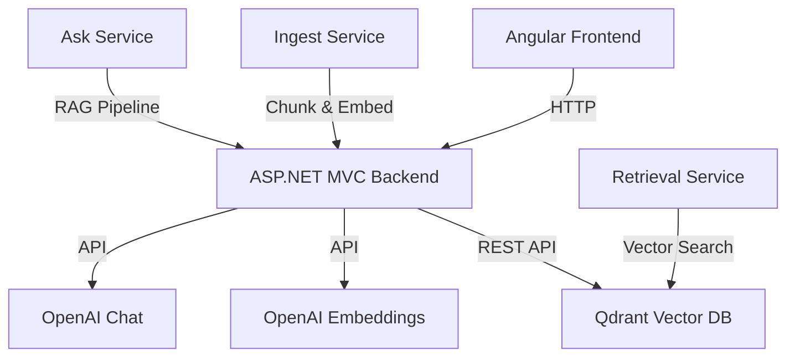

# Payment Ops Console

An internal tool for payments engineers to ingest runbooks, integration docs, and incident notes, then answer questions with checklists and citations using RAG (Retrieval-Augmented Generation).

## Features

- ✅ **Document Ingestion**: Upload markdown/text files or ingest from sample folder
- ✅ **RAG Chat**: Ask questions and get answers with citations
- ✅ **Sources Browser**: View ingested documents and their chunks
- ✅ **Evaluation Harness**: Offline evaluation of RAG quality
- ✅ **Guardrails**: Prompt injection detection, request limits, secret redaction
- ✅ **Observability**: OpenTelemetry tracing, structured logging, correlation IDs

## Architecture



## Quick Start

### Prerequisites

- .NET 8 SDK
- Node.js 18+ and npm
- Docker Desktop
- OpenAI API key

### 1. Start Qdrant

```bash
docker-compose up -d
```

### 2. Set Environment Variable

```bash
# Windows PowerShell
$env:OPENAI_API_KEY = "your-api-key-here"

# Linux/Mac
export OPENAI_API_KEY="your-api-key-here"
```

### 2b. (Recommended) Set .NET User Secrets (Backend)

This keeps keys and machine-specific URLs out of environment variables and out of source control.

```bash
cd src/PaymentOps.Backend
dotnet user-secrets set "OpenAI:ApiKey" "your-api-key-here"
dotnet user-secrets set "Qdrant:BaseUrl" "http://localhost:6333"
```

### 3. Run Services

**Option A: Use run scripts**

```bash
# Windows
.\run-local.ps1

# Linux/Mac
chmod +x run-local.sh
./run-local.sh
```

**Option B: Manual start**

```bash
# Terminal 1: Backend
cd src/PaymentOps.Backend
dotnet run

# Terminal 2: Frontend
cd frontend/payment-ops-ui
npm install
ng serve --open
```

### 4. Access Applications

- **Frontend**: http://localhost:4200
- **Backend API**: http://localhost:5000
- **Swagger UI**: http://localhost:5000/swagger
- **Qdrant Dashboard**: http://localhost:6333/dashboard

## Usage

### Ingest Documents

**Via UI:**
1. Navigate to "Ingest" page
2. Upload `.md` or `.txt` files
3. Or click "Ingest Sample Runbooks" to load sample data

**Via API:**
```bash
# Ingest text
curl -X POST http://localhost:5000/api/ingest/text \
  -H "Content-Type: application/json" \
  -d '{"docName": "My Doc", "text": "Content here..."}'

# Ingest files
curl -X POST http://localhost:5000/api/ingest/files \
  -F "files=@document.md"

# Ingest samples
curl -X POST http://localhost:5000/api/ingest/samples \
  -H "Content-Type: application/json" \
  -d '{"folderPath": "samples/runbooks"}'
```

### Ask Questions

**Via UI:**
1. Navigate to "Chat" page
2. Type your question
3. View answer with citations

**Via API:**
```bash
curl -X POST http://localhost:5000/api/ask \
  -H "Content-Type: application/json" \
  -d '{
    "question": "Auth rate dropped—what should I check?",
    "topK": 5
  }'
```

### View Sources

**Via UI:**
1. Navigate to "Sources" page
2. Browse ingested documents
3. Click to view chunks

**Via API:**
```bash
# List all sources
curl http://localhost:5000/api/sources

# Get source details
curl http://localhost:5000/api/sources/{documentId}
```

## Evaluation

Run the evaluation harness to test RAG quality:

```bash
cd src/PaymentOps.Eval
dotnet run http://localhost:5000 ../../../samples/eval/eval.json ../../../samples/eval/report.md
```

View the generated report:
```bash
cat samples/eval/report.md
```

## Project Structure

```
PaymentOpsCopilot/
├── README.md
├── docker-compose.yml          # Qdrant service
├── run-local.ps1               # Windows run script
├── run-local.sh                # Linux/Mac run script
├── samples/
│   ├── runbooks/               # Sample markdown docs
│   └── eval/
│       ├── eval.json           # Evaluation test cases
│       └── report.md           # Generated evaluation report
├── src/
│   ├── PaymentOps.Backend/    # ASP.NET MVC backend
│   └── PaymentOps.Eval/        # Evaluation console app
└── frontend/
    └── payment-ops-ui/         # Angular SPA
```

## Configuration

### Backend (`appsettings.json`)

```json
{
  "OpenAI": {
    "EmbeddingModel": "text-embedding-3-small",
    "ChatModel": "gpt-4o-mini"
  },
  "Qdrant": {
    "CollectionName": "paymentops_chunks",
    "VectorSize": 1536
  },
  "RAG": {
    "TopK": 5,
    "MinSimilarityScore": 0.7,
    "ChunkSize": 1000,
    "ChunkOverlap": 150,
    "MaxQuestionLength": 2000
  }
}
```

## How It Works

## AI / RAG Glossary (plain English)

This project uses **RAG (Retrieval-Augmented Generation)**: instead of asking an LLM to answer from memory, we first **retrieve** the most relevant snippets from your runbooks and then instruct the model to answer **only** from that retrieved context.

- **LLM (Large Language Model)**: the “chat model” that generates the final answer (here via OpenAI Chat Completions).
- **Prompt**: the text we send to the LLM. We send:
  - **System prompt**: rules/instructions for the assistant (e.g., “only use provided context”, “always cite”).
  - **User prompt**: the user question + the retrieved context.
- **Tokens**: model input/output units (roughly “word pieces”). More tokens = more cost + latency.
- **Temperature**: randomness knob. Lower values are more deterministic and usually better for operational runbooks.
- **Embedding**: a numeric vector representation of text (an array of floats). Similar texts have “nearby” vectors.
- **Vector / Vector size**: the embedding array; its length must match the model’s output dimension (configured via `Qdrant:VectorSize`).
- **Vector database / Vector store**: stores embeddings and lets you run “similarity search” (here: Qdrant).
- **Cosine similarity**: the similarity metric used in Qdrant (“Cosine” distance). Higher score ≈ more similar.
- **Chunk**: a slice of a document (we don’t embed whole runbooks at once). Each chunk has an `Index` and a short `Snippet`.
- **Chunk overlap**: repeated characters between consecutive chunks so important sentences spanning boundaries aren’t lost.
- **TopK**: how many chunks to retrieve for a question (e.g., 5).
- **Similarity threshold (`MinSimilarityScore`)**: optional minimum score; if set too high you may get zero results.
- **Grounding**: forcing the model to answer only using the retrieved context to reduce hallucinations.
- **Hallucination**: when a model invents details not present in the provided context.
- **Citations**: we require the model to cite facts using `[docName:chunkIndex]` and we parse those back out.
- **Prompt injection**: malicious text that tries to override the system rules (“ignore previous instructions…”).
- **Guardrails**: checks that block or constrain unsafe inputs/outputs (prompt injection detection, length limits, citation enforcement).

## How the RAG pipeline maps to the code

If you’re new to RAG, start with these files (they form a straight-through pipeline):

- **Ingestion (docs → chunks → embeddings → vector DB)**:
  - `src/PaymentOps.Backend/Application/Services/ChunkingService.cs`
  - `src/PaymentOps.Backend/Application/Services/IngestService.cs`
  - `src/PaymentOps.Backend/Infrastructure/OpenAIEmbeddingClient.cs`
  - `src/PaymentOps.Backend/Infrastructure/QdrantVectorStore.cs` (`UpsertChunksAsync`)
- **Retrieval (question → embedding → similar chunks)**:
  - `src/PaymentOps.Backend/Application/Services/RetrievalService.cs`
  - `src/PaymentOps.Backend/Infrastructure/QdrantVectorStore.cs` (`SearchAsync`)
- **Answer generation (question + context → grounded answer + citations)**:
  - `src/PaymentOps.Backend/Application/Services/AskService.cs`
  - `src/PaymentOps.Backend/Infrastructure/OpenAIChatClient.cs`
- **Guardrails**:
  - `src/PaymentOps.Backend/Infrastructure/Guardrails/PromptInjectionDetector.cs`

### RAG Pipeline

1. **Ingestion**: Documents are chunked (1000 chars, 150 overlap), embedded, and stored in Qdrant
2. **Retrieval**: User question is embedded and similar chunks are retrieved (topK=5)
3. **Generation**: Retrieved chunks are sent to LLM as context with strict grounding prompt
4. **Citation**: Citations are extracted from answer using regex pattern `[docName:chunkIndex]`

### Guardrails

- **Prompt Injection Detection**: Keyword-based detection of suspicious inputs
- **Request Limits**: Max question length (2000 chars)
- **Secret Redaction**: API keys never logged
- **Grounding Enforcement**: Two-pass validation if no citations found

## Adding Your Own Documents

1. Create markdown or text files in `samples/runbooks/` or any folder
2. Use the UI "Ingest" page to upload files
3. Or use the API `/api/ingest/files` endpoint
4. Documents are automatically chunked and embedded

## Evaluation Details

The evaluation harness (`PaymentOps.Eval`) tests:

- ✅ Citation presence (when `mustCite: true`)
- ✅ Required keywords in answer (from `mustContain` array)
- ✅ "I don't know" response for empty retrieval
- ✅ Citation format validation

Sample output in `samples/eval/report.md`:

```markdown
# Evaluation Report

**Total Tests:** 20
**Passed:** 18 ✅
**Failed:** 2 ❌
**Pass Rate:** 90.0%
```

## UI Screenshots

_(Placeholder - add screenshots after running the app)_

- Chat interface with citations
- Ingest page with file upload
- Sources browser with document list

## Next Improvements

- [ ] Reranking: Use cross-encoder to improve retrieval quality
- [ ] Hybrid Search: Combine vector search with keyword search
- [ ] Authentication: Add JWT auth for multi-user support
- [ ] Streaming: Stream LLM responses for better UX
- [ ] PDF Extraction: Support PDF document ingestion
- [ ] Multi-modal: Support images/diagrams in documents
- [ ] Fine-tuning: Fine-tune embedding model on payment domain
- [ ] Caching: Cache common queries and embeddings

## Troubleshooting

### Qdrant not starting
```bash
docker-compose logs qdrant
docker-compose down
docker-compose up -d
```

### Backend fails to start
- Set OpenAI API key via `OPENAI_API_KEY` **or** User Secrets: `dotnet user-secrets set "OpenAI:ApiKey" "..."` (recommended)
- If Qdrant is not on `http://localhost:6333`, set `dotnet user-secrets set "Qdrant:BaseUrl" "http://host:6333"`
- Verify Qdrant is running: `curl http://localhost:6333/health`
- Check logs: `dotnet run` in backend directory

### Frontend build errors
```bash
cd frontend/payment-ops-ui
rm -rf node_modules package-lock.json
npm install
ng serve
```

### No citations in answers
- Verify documents are ingested: `GET /api/sources`
- Check retrieval is working: Look for `retrieved` array in response
- Review LLM prompt in `AskService.cs`

## License

Internal use only.
